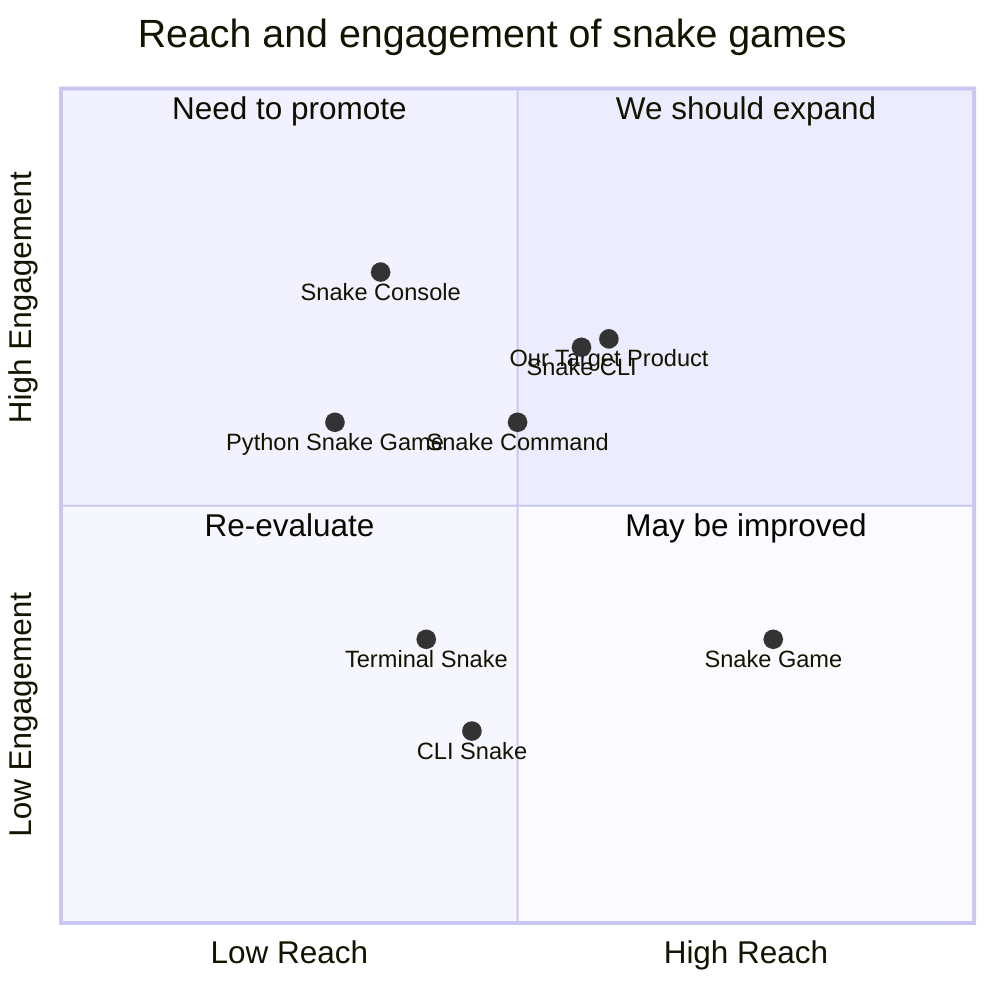

## Original Requirements:

The boss wants a command-line interface (CLI) snake game.

## Product Goals:
```python
[
    "Create a fun and addictive snake game",
    "Provide a user-friendly command-line interface",
    "Ensure smooth and responsive gameplay"
]
```

## User Stories:
```python
[
    "As a player, I want to control the snake using arrow keys",
    "As a player, I want to see my current score and high score",
    "As a player, I want the game to end when the snake hits the wall or itself",
    "As a player, I want the snake to grow longer when it eats food",
    "As a player, I want the speed of the game to increase as I score more points"
]
```

## Competitive Analysis:
```python
[
    "Python Snake Game: A simple snake game with basic features",
    "CLI Snake: A snake game with customizable settings and high score tracking",
    "Snake CLI: A snake game with multiple levels and power-ups",
    "Snake Game: A classic snake game with smooth controls and sound effects",
    "Terminal Snake: A snake game with different game modes and difficulty levels",
    "Snake Console: A snake game with colorful graphics and challenging gameplay",
    "Snake Command: A snake game with intuitive controls and responsive gameplay"
]
```

## Competitive Quadrant Chart:


## Requirement Analysis:
The product should be a CLI snake game with intuitive controls, a scoring system, and increasing difficulty. It should provide a smooth and responsive gameplay experience.

## Requirement Pool:
```python
[
    ("End game when the snake hits the wall or itself", "P0"),
    ("Display current score and high score", "P1"),
    ("Increase snake length when it eats food", "P1"),
    ("Increase game speed as the player scores more points", "P2")
]
```

## UI Design draft:
The game will be displayed in the command-line interface. The snake will be represented by a character, such as an asterisk (*), and the food will be represented by a different character, such as a plus sign (+). The player will control the snake using arrow keys. The current score and high score will be displayed at the top of the screen. The game will end when the snake hits the wall or itself, and a message will be displayed to indicate the end of the game.

## Anything UNCLEAR:
There are no unclear points.