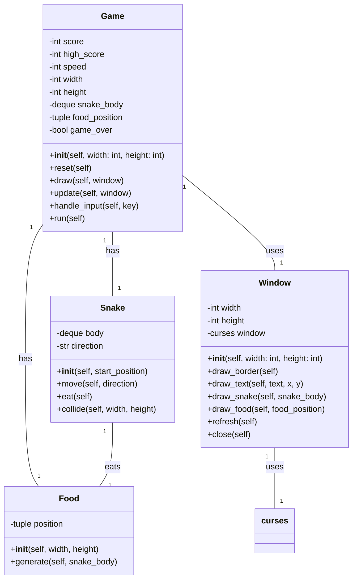
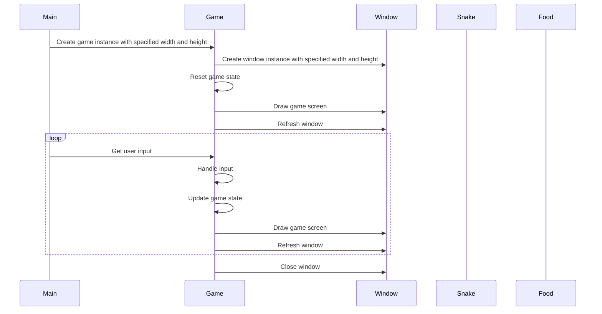

## Implementation approach:
To implement the CLI snake game, we will use the following open-source tools:

1. `curses` library: This library provides a terminal-independent way of creating text-based interfaces. It will be used to handle keyboard input and display the game screen.

2. `random` module: This module will be used to generate random positions for the food in the game.

3. `time` module: This module will be used to control the speed of the game by introducing delays between each frame.

4. `collections` module: This module will be used to implement the snake's body as a deque (double-ended queue) data structure, allowing for efficient insertion and removal of elements.

5. `sys` module: This module will be used to handle system-specific parameters and functions, such as exiting the game.

## Python package name:
```python
"snake_game"
```

## File list:
```python
[
    "main.py",
]
```

## Data structures and interface definitions:


## Program call flow:


## Anything UNCLEAR:
The requirements and design are clear to me.